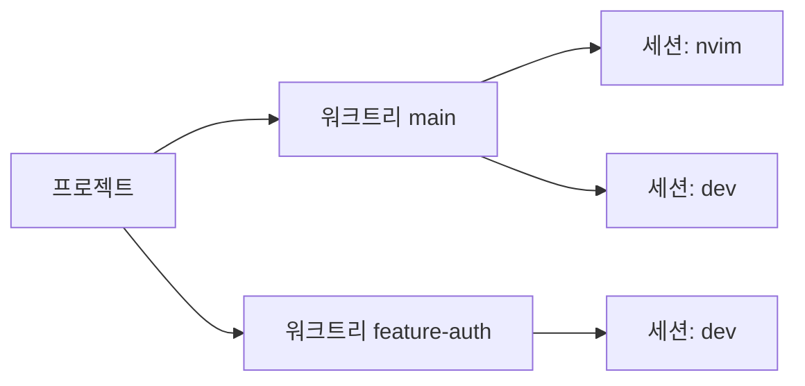

# wsx

[ENG](README.md) | **한국어**

git worktree와 tmux 세션을 위한 TUI 워크스페이스 관리자.

<!-- screenshot -->


## 개요

프로젝트 → 워크트리 → tmux 세션을 사이드바에서 실시간으로 확인합니다.
각 세션의 상태가 실시간으로 표시되어, 들어가지 않아도 어디에 주의가 필요한지 알 수 있습니다.
`n`을 누르면 주의가 필요한 세션을 순회합니다.
내부적으로 tmux를 사용하며 세션을 나가는 detach 단축키는 `ctrl+a - d` 로 커스텀됩니다.

자세한 내용은 아래를 참고합니다.

```
▼ project
  ▾ main * ↑2
      ◉ wsx_cc_main
  ▸ feature-auth ↓1
      ○ wsx_cc_auth
```



## 가이드

| 기능 | 스크린샷 |
|---|---|
| **프로젝트 설정** 저장소 루트의 `.gtrconfig` 파일을 생성하면 명세에 따라, 새 워크트리에 env 파일 자동 복사와 훅을 실행합니다. `e`로 수정 가능합니다. |  |
| **프로젝트 추가** `p`를 누르고 경로 입력하여 프로젝트를 추가할 수 있습니다. Tab 자동완성 지원. |  |
| **새 워크트리** 프로젝트 선택 후 `w`, 브랜치 이름 입력하면 워크트리가 추가됩니다. `r` 입력으로 워크트리에 별명을 붙일 수 있습니다. |   |
| **세션** 워크트리 선택 후 `s`. 용도별 이름 `shell`, `claude`, `build`을 지정할 수 있습니다. `d`로 삭제, `r`로 이름 변경이 가능합니다. |  |
| **순회** `n` / `N`으로 응답이 필요한 `●` 세션을 순회합니다. 순회하고 싶지 않은 세션은 `x`로 해제하거나, 음소거 `⊘`시킬 수 있습니다. `a`로 뭔가 진행중인 `◉` 세션만도 순회가 가능합니다. |  |
| **원격 제어** `S`로 세션에 진입하지 않고도 명령어를 보낼 수 있습니다. `C`로 Ctrl+C 전송. 돌고있는 프로세스를 빠르게 중단할때 유용합니다. |  |
| **복귀** 세션 안에서 `Ctrl+a d`로 wsx로 돌아갈 수 있습니다 | - |

## 설치

**macOS (Homebrew)**
```sh
brew tap vlwkaos/tap
brew install wsx
```

**macOS / Linux (cargo)**
```sh
cargo install wsx
```

**소스에서 빌드**
```sh
cargo install --path .
```

## 사용법

```sh
wsx
```

### 탐색

| 키 | 동작 |
|-----|--------|
| `j/k` `↑/↓` | 커서 이동 |
| `h/l` `←/→` | 접기 / 펼치기 |
| `Enter` | 펼치기 · 세션 접속 |
| `[` / `]` | 이전 / 다음 프로젝트로 이동 |
| `a` | 다음 활성 세션 `◉` |
| `n` / `N` | 다음 / 이전 대기 세션 `●` |
| `x` | 해제 · 음소거 |
| `/` | 검색 |
| `?` | 전체 키 목록 |

마우스 클릭 지원: 행 클릭으로 선택, 미리보기 클릭으로 접속.

### 워크스페이스

| 키 | 동작 |
|-----|--------|
| `p` | 프로젝트 추가 |
| `w` | 새 워크트리 |
| `s` | 새 세션 |
| `u` | 선택한 프로젝트에 새 루틴 생성, `F1`/`F2`로 편집 가능한 Codex/Claude 초기값 적용 |
| `m` | 프로젝트 또는 세션 순서 변경 |
| `r` | 별칭 설정 |
| `d` | 삭제, 실행 중인 루틴은 먼저 취소 |
| `g` | Git 팝업 (pull / push / rebase / merge) |
| `c` | 병합된 워크트리 정리 |
| `e` | 선택한 루틴 수정, 그 외에는 `.gtrignore` 보기 |
| `S` | 세션에 명령 전송 |
| `C` | 세션에 Ctrl+C 전송 |

### tmux 설정

별도의 tmux 설정 파일이 없는 경우:
- prefix를 `ctrl+a`로 설정합니다.
- 접속 시 `status-right`를 `project/worktree`로 설정합니다. `~/.tmux.conf` 커스텀:
- 마우스 설정 활성화

```
set -g status-right "#{@wsx_project}/#{@wsx_alias}"
```

Agent 상태 감지는 provider 중립적이며 별도 플러그인이 필요하지 않습니다. wsx는 먼저 foreground process를 분류하고, agent가 터미널 활동을 낼 때 제한된 pane tail을 비교합니다. 화면 변화가 계속되면 active를 유지하고 동일한 redraw가 반복되면 3초 후 attention으로 전환합니다. Runtime과 watch process는 실행 중 active를 유지하며 capture 실패 시 tmux 활동으로 대체합니다.

## 모바일 / SSH

```sh
wsx --mobile
```

미리보기 패널을 숨기고 간결한 키 힌트를 표시합니다 — 세로 모드 SSH 환경(폰, 좁은 터미널)에 적합합니다. `mobile_detach_key` 설정으로 no-prefix tmux detach 단축키를 지정할 수 있습니다:

```toml
# ~/.config/wsx/config.toml
mobile_detach_key = "C-q"
```

## CLI

### 머신 로컬 루틴

`wsx routine`은 [asched](https://github.com/vlwkaos/asched)의 프로젝트별 클라이언트입니다. 각 wsx 프로젝트 노드는 동일한 canonical 프로젝트 경로로 등록된 루틴만 표시합니다. asched는 별도로 설치하고 실행하며 wsx는 스케줄러를 내장하거나 시작하지 않습니다.

```sh
wsx routine add nightly --cron "0 2 * * *" --arg codex --arg exec --arg=--json --arg '{prompt}' --prompt "유지보수를 실행해 줘" -p wsx
wsx routine list -p wsx
wsx routine show nightly -p wsx
wsx routine run nightly -p wsx
wsx routine cancel nightly -p wsx
wsx routine logs nightly -p wsx
wsx routine fire --kind filesystem.changed --event-id delivery-123 --payload '{"path":"src/main.rs"}' -p wsx
wsx routine delete nightly -p wsx
```

wsx와 asched는 동일한 플랫폼 기본 상태 디렉터리를 사용하며 `ASCHED_ROOT`로 함께 재정의할 수 있습니다. 프로젝트는 `asched project add`로 등록하며 이 레지스트리가 스케줄링 allowlist입니다. 하나의 asched 데몬만 루틴 쓰기, 예약, 실행, 이벤트 중복 제거를 소유합니다. wsx는 변경 시 optimistic revision을 보내고 conflict, protocol mismatch, deduplicated/no-match 이벤트, already-running 상태를 표시합니다.

TUI에서는 프로젝트나 그 하위 항목에서 `u`를 눌러 첫 루틴을 생성한 뒤, 프로젝트 수준의 `sched` 섹션에서 이후 루틴을 관리합니다. `F1`/`F2`로 편집 가능한 Codex/Claude 초기값을 적용하고, `e`로 수정하며 확인된 `d`로 삭제합니다. 실행 중 삭제는 먼저 취소합니다. command argv는 shell 문자열이 아닌 JSON 배열로 편집합니다. 미리보기에는 설정, 다음/최근 실행, 로그 경로, 현재 허용된 동작, 최종 agent output이 표시되며 모바일에서는 Enter로 전체 화면 상세를 엽니다.

루틴 저장, 최근 실행과 로그, cron/event 의미, 실행 정리, 데몬 lifecycle은 asched가 소유합니다. TUI의 데몬 I/O는 background worker에서 실행되어 느리거나 unavailable인 데몬이 탐색을 막지 않습니다. 미리보기는 `asched_core::routine::ipc::RoutineView`에서 enabled/running capability, 다음 cron 실행, 최신 결과, 최근 이력을 직접 표시합니다.

```sh
# 워크트리
wsx worktree create <branch> [-p <project>]
wsx worktree delete <branch> [-p <project>]
wsx worktree list  [-p <project>] [--json]

# 세션
wsx session send-keys <session> <keys>
wsx session peek <session> [-n <lines>] [-o <offset>] [-a]
wsx session rename <old> <new>
wsx session list   [-p <project>] [--json]

# 상태
wsx status [--json]
```

`peek`은 pane 출력을 캡처합니다. `-n`은 스크롤백 줄 수(기본값: 현재 화면), `-o`는 아래에서 건너뛸 줄 수, `-a`는 ANSI/장식 문자 제거(에이전트/LLM 입력용).

## 설정

전역 설정: `~/.config/wsx/config.toml`. 프로젝트별 설정은 `e` 키로 확인.

### .gtrconfig 명세

워크 트리 생성시 사용

```ini
[hooks]
  postCreate = npm install

[copy]
  include = .env
  include = .env.local
  exclude = .env.production
```

## 영감

- [git-worktree-runner](https://github.com/coderabbitai/git-worktree-runner)
- [agent-of-empires](https://github.com/njbrake/agent-of-empires)
