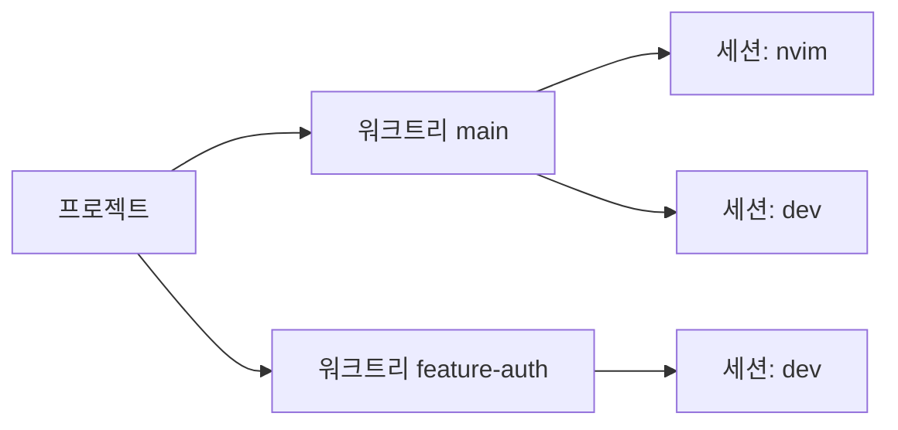

# wsx

[ENG](README.md) | **한글**

git worktree와 tmux 세션을 위한 TUI 워크스페이스 관리자.

<!-- screenshot -->


## 핵심 아이디어

프로젝트 → 워크트리 → tmux 세션을 사이드바에서 실시간으로 확인합니다.
각 세션의 상태가 실시간으로 표시되어, 들어가지 않아도 어디에 주의가 필요한지 알 수 있습니다.
`n`을 누르면 주의가 필요한 세션을 순회합니다.

```
▼ project
  ▾ main * ↑2
      ◉ wsx_cc_main
  ▸ feature-auth ↓1
      ○ wsx_cc_auth
```



## 가이드

| 기능 | 스크린샷 |
|---|---|
| **프로젝트 설정** 저장소 루트의 `.gtrconfig` — 생성 후 훅, 새 워크트리에 env 파일 자동 복사. `e`로 확인. |  |
| **프로젝트 추가** `p`를 누르고 경로 입력. Tab 자동완성 지원. |  |
| **새 워크트리** 프로젝트 선택 후 `w`, 브랜치 이름 입력. |   |
| **세션** 워크트리 선택 후 `s`. 용도별 이름 — `shell`, `claude`, `build`. 세션은 영구 tmux 세션이며, `d`로 삭제, `r`로 이름 변경. |  |
| **대기 순회** `n` / `N`으로 `●` 세션 사이 이동. `x`로 해제, 한번 더 누르면 음소거 `⊘`. `a`로 활성 `◉` 세션 순회. |  |
| **원격 제어** `S`로 선택된 세션에 명령 전송. `C`로 Ctrl+C 전송 — 와처를 발견하는 즉시 종료할 때 유용. |  |
| **디태치로 복귀** 세션 안에서 `Ctrl+a d`로 wsx로 돌아옴. 세션은 계속 실행됨. | |

## 설치

**macOS (Homebrew)**
```sh
brew tap vlwkaos/tap
brew install wsx
```

**macOS / Linux (cargo)**
```sh
cargo install wsx
```

**소스에서 빌드**
```sh
cargo install --path .
```

> tmux 세션 안에서 실행해야 합니다.

## 사용법

```sh
wsx
```

### 탐색

| 키 | 동작 |
|-----|--------|
| `j/k` `↑/↓` | 커서 이동 |
| `h/l` `←/→` | 접기 / 펼치기 |
| `Enter` | 펼치기 · 세션 접속 |
| `[` / `]` | 이전 / 다음 프로젝트로 이동 |
| `a` | 다음 활성 세션 `◉` |
| `n` / `N` | 다음 / 이전 대기 세션 `●` |
| `x` | 해제 · 음소거 |
| `/` | 검색 |
| `?` | 전체 키 목록 |

마우스 클릭 지원: 행 클릭으로 선택, 미리보기 클릭으로 접속.

### 워크스페이스

| 키 | 동작 |
|-----|--------|
| `p` | 프로젝트 추가 |
| `w` | 새 워크트리 |
| `s` | 새 세션 |
| `m` | 프로젝트 또는 세션 순서 변경 |
| `r` | 별칭 설정 |
| `d` | 삭제 |
| `g` | Git 팝업 (pull / push / rebase / merge) |
| `c` | 병합된 워크트리 정리 |
| `e` | `.gtrconfig` 보기 |
| `S` | 세션에 명령 전송 |
| `C` | 세션에 Ctrl+C 전송 |

### tmux 상태 바

접속 시 `status-right`를 `project/worktree`로 설정합니다. `~/.tmux.conf` 커스텀:

```
set -g status-right "#{@wsx_project}/#{@wsx_alias}"
```

## 설정

전역 설정: `~/.config/wsx/config.toml`. 프로젝트별 설정은 `e` 키로 확인.

### .gtrconfig

```ini
[hooks]
  postCreate = npm install

[copy]
  include = .env
  include = .env.local
  exclude = .env.production
```

## 영감

- [git-worktree-runner](https://github.com/coderabbitai/git-worktree-runner)
- [agent-of-empires](https://github.com/njbrake/agent-of-empires)
