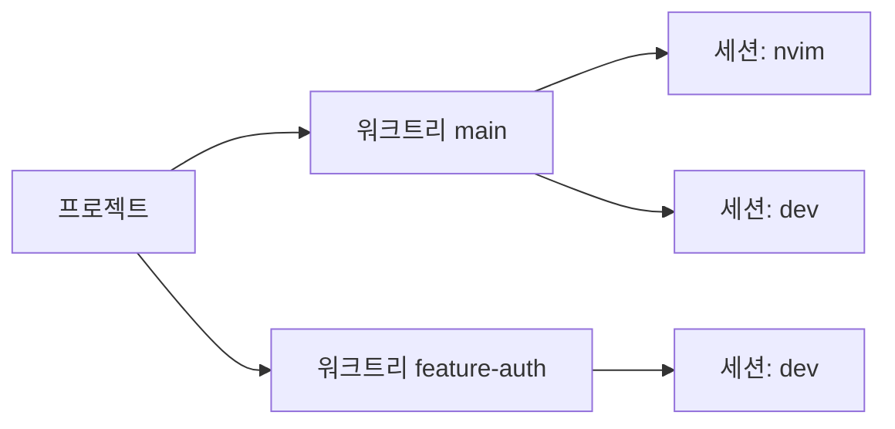

# wsx

[ENG](README.md) | **한국어**

Git worktree와 영속적인 Herdr 세션을 위한 TUI 워크스페이스 관리자.

<!-- screenshot -->


## 개요

프로젝트 → 워크트리 → Herdr pane을 사이드바에서 실시간으로 확인합니다.
Herdr가 agent lifecycle 상태와 지원되는 agent 대화 복원을 담당합니다.
`n`을 누르면 주의가 필요한 세션을 순회합니다. 세션에서 `Ctrl+b q`로 wsx에 복귀합니다.

자세한 내용은 아래를 참고합니다.

```
▼ project
  ▾ main * ↑2
      ◉ wsx_cc_main
  ▸ feature-auth ↓1
      ○ wsx_cc_auth
```



## 가이드

| 기능 | 스크린샷 |
|---|---|
| **프로젝트 설정** 저장소 루트의 `.gtrconfig` 파일을 생성하면 명세에 따라 새 워크트리에 env 파일 자동 복사와 훅을 실행합니다. `e`로 확인할 수 있습니다. |  |
| **프로젝트 추가** `p`를 누르고 경로 입력하여 프로젝트를 추가할 수 있습니다. Tab 자동완성 지원. |  |
| **새 워크트리** 프로젝트 선택 후 `w`, 브랜치 이름 입력하면 워크트리가 추가됩니다. `r` 입력으로 워크트리에 별명을 붙일 수 있습니다. |   |
| **세션** 워크트리 선택 후 `s`. 용도별 이름 `shell`, `claude`, `build`을 지정할 수 있습니다. `d`로 삭제, `r`로 이름 변경이 가능합니다. |  |
| **주의 세션 순회** `n` / `N`으로 blocked `×` 또는 done `✓` 세션을 순회합니다. `x`는 로컬 sticky mute `⊘`를 토글합니다. `a`는 working `◐` 세션을 순회합니다. |  |
| **원격 제어** `S`로 agent pane에는 prompt를, shell pane에는 terminal text를 보냅니다. `C`로 Ctrl+C를 전송합니다. |  |
| **탭** `T`로 탭 관리자를 열어 탭을 만들고 프로젝트를 할당합니다. `{` / `}`로 탭을 전환합니다. | - |
| **복귀** 세션 안에서 `Ctrl+b q`로 wsx로 돌아갈 수 있습니다 | - |

## 설치

**macOS (Homebrew)**
```sh
brew tap vlwkaos/tap
brew install wsx
```

Homebrew 패키지는 `wsx`와 Herdr 0.8.2 companion binary를 함께 설치합니다.

**macOS / Linux (cargo)**
```sh
cargo install wsx
cargo +1.96.1 install herdr --version 0.8.2 --locked
```

**소스에서 빌드**
```sh
cargo install --path crates/wsx
cargo +1.96.1 install --path vendor/herdr --locked
```

Herdr 소스 빌드에는 Zig 0.15가 필요합니다. 사용하는 agent integration도 설치해야 합니다. wsx는 Herdr protocol 20을 사용하고 headless server를 필요할 때 시작합니다.

## 사용법

```sh
wsx
```

### 탐색

| 키 | 동작 |
|-----|--------|
| `j/k` `↑/↓` | 커서 이동 |
| `h/l` `←/→` | 접기 / 펼치기 |
| `Enter` | 펼치기 · 세션 접속 |
| `[` / `]` | 이전 / 다음 프로젝트로 이동 |
| `a` | 다음 working 세션 `◐` |
| `n` / `N` | 다음 / 이전 blocked `×` 또는 done `✓` 세션 |
| `x` | 로컬 sticky mute `⊘` 토글 |
| `/` | 검색 |
| `?` | 전체 키 목록 |

마우스 클릭 지원: 행 클릭으로 선택, 미리보기 클릭으로 접속.

### 워크스페이스

| 키 | 동작 |
|-----|--------|
| `p` | 프로젝트 추가 |
| `w` | 새 워크트리 |
| `s` | 새 세션 |
| `u` | 선택한 프로젝트에 새 루틴 생성, `F1`/`F2`로 편집 가능한 Codex/Claude 초기값 적용 |
| `m` | 프로젝트 또는 세션 순서 변경 |
| `r` | 별칭 설정 |
| `d` | 삭제, 실행 중인 루틴은 먼저 취소 |
| `c` | 병합된 워크트리 정리 |
| `e` | 선택한 루틴 수정, 그 외에는 `.gtrconfig` 보기 |
| `S` | agent pane에 prompt 또는 shell pane에 text 전송 |
| `C` | 세션에 Ctrl+C 전송 |
| `T` | 탭 관리자 열기 |
| `{` / `}` | 이전 / 다음 탭 전환 |

### Herdr runtime

Herdr가 PTY, pane 출력, agent lifecycle 상태, 영속성, 지원 agent의 native session 복원을 소유합니다. wsx는 terminal activity를 추측하지 않고 Herdr의 `working`, `blocked`, `done`, `idle`, `unknown` 상태를 직접 표시합니다. Agent pane에는 Herdr agent API로 prompt를 보내고 shell pane에는 terminal text를 보냅니다. `herdr integration install <agent>`로 integration을 설치합니다. Herdr local socket은 동일 사용자 신뢰 경계이므로 신뢰할 수 없는 local process에 노출하지 마세요.

## 모바일 / SSH

```sh
wsx --mobile
```

너비가 60열보다 작으면 미리보기 패널을 자동으로 숨기고 간결한 키 힌트를 표시합니다. `--mobile`은 너비와 관계없이 이 레이아웃을 강제합니다. Herdr의 `Ctrl+b q` detach 단축키는 동일하게 동작합니다.

## CLI

### 머신 로컬 루틴

`wsx routine`은 [asched](https://github.com/vlwkaos/asched)의 프로젝트별 클라이언트입니다. `asched` 실행 파일을 설치하면 wsx가 `asched-core`의 지원 API를 통해 단일 machine-local daemon을 필요할 때 시작합니다.

```sh
wsx routine add nightly --cron "0 2 * * *" --arg codex --arg exec --arg=--json --arg '{prompt}' --prompt "유지보수를 실행해 줘" -p wsx
wsx routine list -p wsx
wsx routine show nightly -p wsx
wsx routine edit nightly --cron "0 3 * * *" --arg codex --arg exec -p wsx
wsx routine disable nightly -p wsx
wsx routine enable nightly -p wsx
wsx routine run nightly -p wsx
wsx routine cancel nightly -p wsx
wsx routine logs nightly -p wsx
wsx routine fire --kind filesystem.changed --event-id delivery-123 --payload '{"path":"src/main.rs"}' -p wsx
wsx routine delete nightly -p wsx
```

wsx와 asched는 동일한 플랫폼 기본 상태 디렉터리를 사용하며 `ASCHED_ROOT`로 함께 재정의할 수 있습니다. 프로젝트는 `asched project add`로 등록하며 이 레지스트리가 스케줄링 allowlist입니다. 하나의 asched 데몬만 루틴 쓰기, 예약, 실행, 이벤트 중복 제거를 소유합니다. wsx는 변경 시 optimistic revision을 보내고 conflict, protocol mismatch, deduplicated/no-match 이벤트, already-running 상태를 표시합니다.

TUI에서는 프로젝트나 그 하위 항목에서 `u`를 눌러 첫 루틴을 생성한 뒤, 프로젝트 수준의 `sched` 섹션에서 이후 루틴을 관리합니다. `F1`/`F2`로 편집 가능한 Codex/Claude 초기값을 적용하고, `e`로 수정하며 확인된 `d`로 삭제합니다. 실행 중 삭제는 먼저 취소합니다. command argv는 shell 문자열이 아닌 JSON 배열로 편집합니다. 미리보기에는 설정, 다음/최근 실행, 로그 경로, 현재 허용된 동작, 최종 agent output이 표시되며 모바일에서는 Enter로 전체 화면 상세를 엽니다.

루틴 저장, 최근 실행과 로그, cron/event 의미, 실행 정리, 데몬 lifecycle은 asched가 소유합니다. 정확한 asched v0.2.0 소스는 Git subtree인 `vendor/asched`에 포함되며 두 wsx crate는 로컬 `asched-core` 경로를 사용합니다. 업데이트는 `git subtree pull --prefix vendor/asched https://github.com/vlwkaos/asched.git <tag> --squash`를 사용합니다.

```sh
# 워크트리
wsx worktree create <branch> [-p <project>]
wsx worktree delete <branch> [-p <project>]
wsx worktree list  [-p <project>] [--json]

# 세션
wsx session send-text <pane-id> <text> [--no-enter]
wsx session send-keys <pane-id> <keys> [--no-enter] # deprecated alias
wsx session prompt <pane-id> <text>
wsx session peek <pane-id> [-n <lines>] [-o <offset>] [--trim] [-a]
wsx session rename <pane-id> <label>
wsx session list   [-p <project>] [--json]

# 탭
wsx tab ls
wsx tab create <name>
wsx tab rename <old> <new>
wsx tab own <tab> <project>

# 상태
wsx status [--json]
wsx herdr status [--json]
```

`peek`은 Herdr pane 출력을 읽습니다. `-n` 기본값은 200줄이며, `-o`는 아래에서 건너뛸 줄 수, `-a`는 ANSI/장식 문자 제거 옵션입니다. `wsx herdr status`는 Herdr를 시작하거나 수정하지 않고 진단 정보를 표시합니다.

## 설정

전역 설정: `~/.config/wsx/config.toml`. 프로젝트별 설정은 `e` 키로 확인. wsx는 nonempty `WSX_HERDR_BIN`, wsx 옆의 bundled `herdr`, `PATH` 순서로 Herdr를 찾습니다. `herdr status server --json`이 명시적으로 `not_running`일 때만 headless server를 시작하며 호환되지 않는 실행 중 server는 교체하지 않습니다. `HERDR_SOCKET_PATH`는 절대 경로 socket override입니다. `ASCHED_BIN`은 routine daemon 실행 파일을 재정의합니다. 이 override들과 `ASCHED_ROOT`, 동일 사용자 socket 및 state directory는 신뢰할 수 있는 local control로 취급하세요.

### .gtrconfig 명세

워크 트리 생성시 사용

```ini
[hooks]
  postCreate = npm install

[copy]
  include = .env
  include = .env.local
  exclude = .env.production
```

## 영감

- [git-worktree-runner](https://github.com/coderabbitai/git-worktree-runner)
- [agent-of-empires](https://github.com/njbrake/agent-of-empires)
