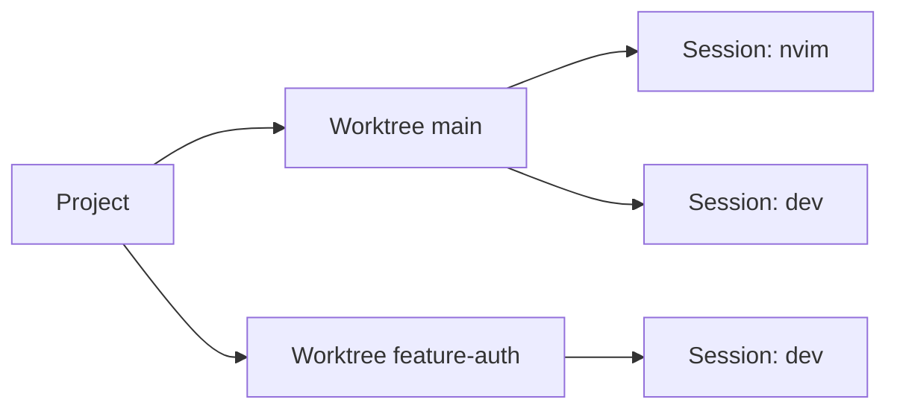

# wsx

**ENG** | [한국어](README.ko.md)

TUI workspace manager for Git worktrees and persistent Herdr sessions.

<!-- screenshot -->


## The core idea

Keep a live view of every project → worktree → Herdr pane in a sidebar.
Herdr supplies agent lifecycle state and restores supported agent conversations after a server restart.
Simply pressing `n` to iterate sessions where attention is required.

```
▼ project
  ▾ main * ↑2
      ◐ wsx_cc_main · working
  ▸ feature-auth ↓1
      ○ wsx_cc_auth · idle
```



## Install

**macOS (Homebrew)**
```sh
brew tap vlwkaos/tap
brew install wsx
```

The Homebrew package installs both `wsx` and its Herdr 0.8.2 companion binary.

**macOS / Linux (cargo)**
```sh
cargo install wsx
cargo +1.96.1 install herdr --version 0.8.2 --locked
```

**Build from source**
```sh
cargo install --path crates/wsx
cargo +1.96.1 install --path vendor/herdr --locked
```

Source builds of Herdr require Zig 0.15. Install Herdr integrations for the agents you use. wsx requires Herdr protocol 20 and starts the headless server on demand.

## Guide

| Feature | Screenshot |
|---|---|
| **Project config** `.gtrconfig` at repo root — post-create hook, auto-copy env files into new worktrees. Press `e` to view. |  |
| **Add project** Press `p`, enter a path. Tab-completion supported. |  |
| **New worktree** Select a project, press `w`, enter a branch name. |   |
| **Sessions** Select a worktree, press `s`. Each session is a persistent Herdr pane; `d` closes it and `r` changes its label. |  |
| **Iterate attention** `n` / `N` jumps between blocked `×` and done `✓` sessions. `x` toggles sticky local mute `⊘`. `a` cycles working `◐` sessions. |  |
| **Remote control** `S` prompts an agent pane or sends text to a shell pane without attaching. `C` sends Ctrl+C. |  |
| **Tabs** Press `T` to open the tab manager — create named tabs and assign projects to them. `{` / `}` cycles tabs. Active tab shown full, others abbreviated in the title bar: `[default\|pe\|wo]` | |

> [!IMPORTANT]
> **Returning to wsx from inside a session:** press `Ctrl+b q`. Herdr keeps the pane and agent process running.

### .gtrconfig

Place `.gtrconfig` at the root of any project repo to automate worktree setup.

> [!TIP]
> New worktrees automatically run `postCreate` and receive copies of listed env files — no manual setup per branch.

```ini
[hooks]
  postCreate = npm install

[copy]
  include = .env
  include = .env.local
  exclude = .env.production
```

Press `e` on any project or worktree to view its config.

## Usage

```sh
wsx
```

<details>
<summary>Navigation</summary>

| Key | Action |
|-----|--------|
| `j/k` `↑/↓` | Move cursor |
| `h/l` `←/→` | Collapse / expand |
| `Enter` | Expand · attach session |
| `[` / `]` | Jump to prev / next project |
| `a` | Next working session `◐` |
| `n` / `N` | Next / previous blocked `×` or done `✓` session |
| `x` | Toggle sticky local mute `⊘` |
| `/` | Incremental search |
| `?` | Full key reference |

Mouse clicks work: click a row to select, click the preview to attach.

</details>

<details>
<summary>Workspaces</summary>

| Key | Action |
|-----|--------|
| `p` | Add project |
| `w` | New worktree |
| `s` | New session |
| `u` | New routine for the selected project; `F1`/`F2` apply editable Codex/Claude presets |
| `m` | Reorder project or session |
| `r` | Set alias |
| `d` | Delete; a running routine is cancelled before deletion |
| `c` | Clean merged worktrees |
| `e` | Edit the selected routine, otherwise view `.gtrconfig` |
| `S` | Prompt an agent pane or send text to a shell pane |
| `C` | Send Ctrl+C to session |
| `T` | Tab manager (add / rename / delete / reorder) |
| `{` / `}` | Switch to prev / next tab |
| `m` + `h`/`l` | Move project to adjacent tab (in Move mode) |

</details>

<details>
<summary>Herdr runtime</summary>

Herdr owns PTYs, persistence, pane output, agent lifecycle state, and native agent-session restoration. wsx projects Herdr's `working`, `blocked`, `done`, `idle`, and `unknown` states directly instead of inferring state from terminal activity. Agent panes receive prompts through Herdr's agent API; shell panes receive terminal text. Install integrations with `herdr integration install <agent>`.

Herdr's local socket is a same-user control boundary. Do not expose it to untrusted local processes; agent processes running under that user share the same trust domain.

</details>

## Mobile / SSH

```sh
wsx --mobile
```

At widths below 60 columns, wsx automatically collapses the preview panel and shows compact key hints. `--mobile` forces this layout at any width. Herdr uses the same `Ctrl+b q` detach gesture.

## CLI

### Machine-local routines

`wsx routine` is a project-scoped client for [asched](https://github.com/vlwkaos/asched). Each wsx project node shows routines registered for the same canonical project path. Install the `asched` executable; wsx starts its single machine-local daemon on demand through `asched-core`.

```sh
wsx routine add nightly --cron "0 2 * * *" --arg codex --arg exec --arg=--json --arg '{prompt}' --prompt "Run maintenance" -p wsx
wsx routine list -p wsx
wsx routine show nightly -p wsx
wsx routine edit nightly --cron "0 3 * * *" --arg codex --arg exec -p wsx
wsx routine disable nightly -p wsx
wsx routine enable nightly -p wsx
wsx routine run nightly -p wsx
wsx routine cancel nightly -p wsx
wsx routine logs nightly -p wsx
wsx routine fire --kind filesystem.changed --event-id delivery-123 --payload '{"path":"src/main.rs"}' -p wsx
wsx routine delete nightly -p wsx
```

wsx and asched resolve the same platform-default state directory, overridden by `ASCHED_ROOT`. Register projects with `asched project add`; that registry remains the scheduling allowlist. The single asched daemon owns routine writes, scheduling, execution, and event deduplication. wsx sends optimistic revisions for mutations and reports conflicts, protocol mismatch, deduplicated/no-match events, and already-running routines.

In the TUI, press `u` on a project or any of its entries to create the first routine, then expand its project-level `sched` section for later entries. `e` edits, and confirmed `d` deletes or cancels then deletes. The form keeps command argv as a JSON array so arguments never pass through a shell. The preview shows configuration, next/last run, log paths, currently allowed actions, and final agent output. On mobile, Enter opens the routine detail full-screen.

Routine persistence, retained history/logs, cron and event semantics, execution cleanup, and daemon lifecycle belong to asched. TUI daemon I/O runs on background workers. The exact asched v0.2.0 source is included at `vendor/asched` as a Git subtree, and both wsx crates use its local `asched-core` path.

Update the subtree with `git subtree pull --prefix vendor/asched https://github.com/vlwkaos/asched.git <tag> --squash`, then update the pinned version if the tag changes.

```sh
# Worktrees
wsx worktree create <branch> [-p <project>]
wsx worktree delete <branch> [-p <project>]
wsx worktree list  [-p <project>] [--json]

# Sessions
wsx session send-text <pane-id> <text> [--no-enter]
wsx session send-keys <pane-id> <keys> [--no-enter] # deprecated alias
wsx session prompt <pane-id> <text>
wsx session peek <pane-id> [-n <lines>] [-o <offset>] [--trim] [-a]
wsx session rename <pane-id> <label>
wsx session list   [-p <project>] [--json]

# Tabs
wsx tab ls
wsx tab create <name>
wsx tab rename <old> <new>
wsx tab own <tab> <project>

# Status
wsx status [--json]
wsx herdr status [--json]
```

`peek` reads Herdr pane output. `-n` sets the line count (default: 200), `-o` skips lines from the bottom, and `-a` strips ANSI/decorations for agent/LLM consumption. `wsx herdr status` reports diagnostics without starting or repairing Herdr.

## Config

<details>
<summary>Global config</summary>

Global config: `~/.config/wsx/config.toml`. Per-project config via `e` key.

wsx resolves Herdr from nonempty `WSX_HERDR_BIN`, an adjacent bundled `herdr`, then `PATH`. It starts `herdr server` only when `herdr status server --json` explicitly reports `not_running`; it never replaces an incompatible running server. `HERDR_SOCKET_PATH` may override the reported socket with an absolute path. `ASCHED_BIN` overrides the `asched` executable used to start the routine daemon. Treat these overrides, `ASCHED_ROOT`, and their same-user sockets and state directories as trusted local controls.

</details>

## Inspired by

- [git-worktree-runner](https://github.com/coderabbitai/git-worktree-runner)
- [agent-of-empires](https://github.com/njbrake/agent-of-empires)
