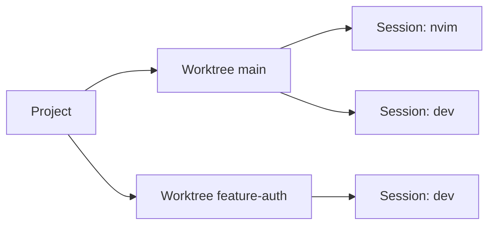

# wsx

**ENG** | [한국어](README.ko.md)

TUI workspace manager for git worktrees and tmux sessions.

<!-- screenshot -->


## The core idea

Keep a live view of every project → worktree → tmux session in a sidebar.
Each session shows real-time state so you can see what needs attention without entering it.
Simply pressing `n` to iterate sessions where attention is required.

```
▼ project
  ▾ main * ↑2
      ◉ wsx_cc_main
  ▸ feature-auth ↓1
      ○ wsx_cc_auth
```



## Install

**macOS (Homebrew)**
```sh
brew tap vlwkaos/tap
brew install wsx
```

**macOS / Linux (cargo)**
```sh
cargo install wsx
```

**Build from source**
```sh
cargo install --path .
```

> Must be run inside a tmux session.

## Guide

| Feature | Screenshot |
|---|---|
| **Project config** `.gtrconfig` at repo root — post-create hook, auto-copy env files into new worktrees. Press `e` to view. |  |
| **Add project** Press `p`, enter a path. Tab-completion supported. |  |
| **New worktree** Select a project, press `w`, enter a branch name. |   |
| **Sessions** Select a worktree, press `s`. Name by context — `shell`, `claude`, `build`. Sessions are persistent tmux sessions; `d` deletes, `r` renames. |  |
| **Iterate pending** `n` / `N` to jump between `●` sessions. `x` dismisses; press again to mute `⊘`. `a` cycles active `◉` sessions. |  |
| **Remote control** `S` sends a command to the selected session without entering it. `C` sends Ctrl+C — handy for killing a watcher the moment you spot it. |  |
| **Tabs** Press `T` to open the tab manager — create named tabs and assign projects to them. `{` / `}` cycles tabs. Active tab shown full, others abbreviated in the title bar: `[default\|pe\|wo]` | |

> [!IMPORTANT]
> **Returning to wsx from inside a session:** press `Ctrl+a d` to detach. The session keeps running.
>
> If your tmux prefix is not `Ctrl+a`, add this to `~/.tmux.conf`:
> ```
> set -g prefix C-a
> ```

### .gtrconfig

Place `.gtrconfig` at the root of any project repo to automate worktree setup.

> [!TIP]
> New worktrees automatically run `postCreate` and receive copies of listed env files — no manual setup per branch.

```ini
[hooks]
  postCreate = npm install

[copy]
  include = .env
  include = .env.local
  exclude = .env.production
```

Press `e` on any project or worktree to view its config.

## Usage

```sh
wsx
```

<details>
<summary>Navigation</summary>

| Key | Action |
|-----|--------|
| `j/k` `↑/↓` | Move cursor |
| `h/l` `←/→` | Collapse / expand |
| `Enter` | Expand · attach session |
| `[` / `]` | Jump to prev / next project |
| `a` | Next active session `◉` |
| `n` / `N` | Next / prev pending session `●` |
| `x` | Dismiss · mute session |
| `/` | Incremental search |
| `?` | Full key reference |

Mouse clicks work: click a row to select, click the preview to attach.

</details>

<details>
<summary>Workspaces</summary>

| Key | Action |
|-----|--------|
| `p` | Add project |
| `w` | New worktree |
| `s` | New session |
| `m` | Reorder project or session |
| `r` | Set alias |
| `d` | Delete |
| `g` | Git popup (pull / push / rebase / merge) |
| `c` | Clean merged worktrees |
| `e` | View `.gtrconfig` |
| `S` | Send command to session |
| `C` | Send Ctrl+C to session |
| `T` | Tab manager (add / rename / delete / reorder) |
| `{` / `}` | Switch to prev / next tab |
| `m` + `h`/`l` | Move project to adjacent tab (in Move mode) |

</details>

<details>
<summary>tmux status bar</summary>

wsx sets `status-right` to `project/worktree` on attach. With a custom `~/.tmux.conf`:

```
set -g status-right "#{@wsx_project}/#{@wsx_alias}"
```

</details>

## Config

<details>
<summary>Global config</summary>

Global config: `~/.config/wsx/config.toml`. Per-project config via `e` key.

</details>

## Inspired by

- [git-worktree-runner](https://github.com/coderabbitai/git-worktree-runner)
- [agent-of-empires](https://github.com/njbrake/agent-of-empires)
