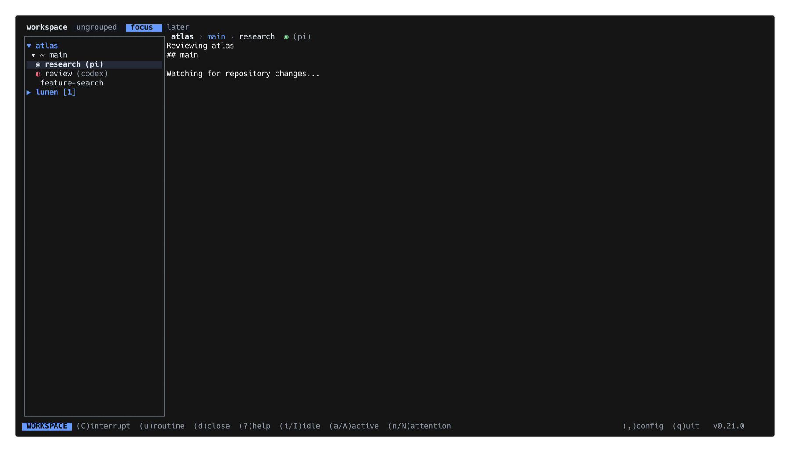
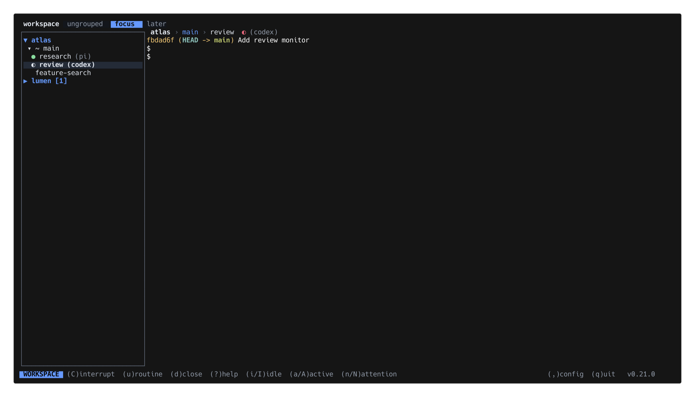
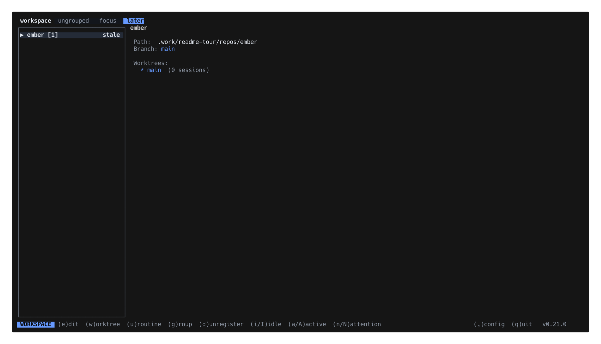
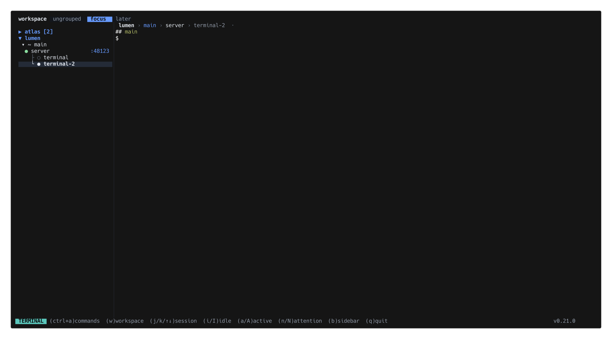
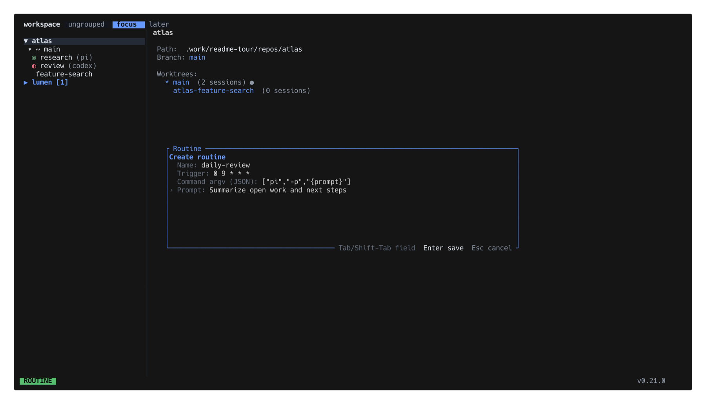
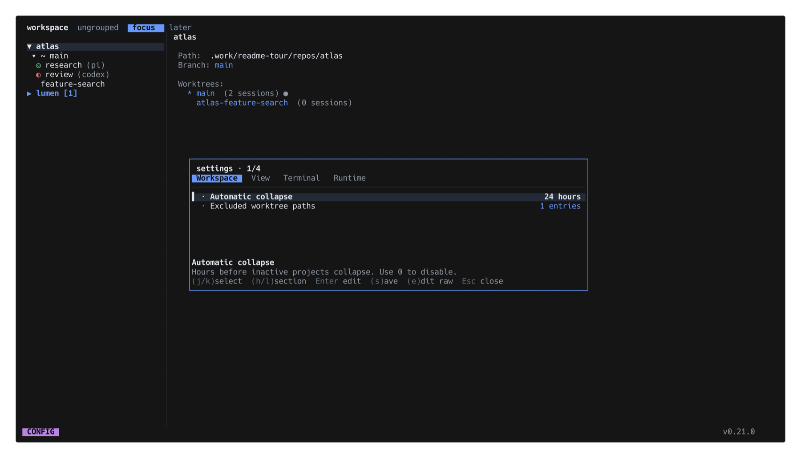

# wsx

[](https://github.com/vlwkaos/wsx/actions/workflows/ci.yml)

Project-first terminal workspace manager for Git worktrees.

wsx presents **Project → Worktree → Session → Pane** in a keyboard-first TUI. Sessions stay visible as task contexts. Multi-pane sessions expose optional pane rows beneath them. The adjacent `wsxd` daemon owns PTYs and pinned `libghostty-vt` state, so terminals continue running while clients disconnect.



## Features

- Git project and worktree discovery, creation, confirmed deletion, status, aliases, and project groups
- Persistent sessions and optional horizontal or vertical pane splits
- Writable styled terminal viewport with application cursor shape, resize, keyboard, and mouse support
- Workspace mode for navigation and Terminal mode for direct PTY input
- One explicit writable lease per pane with explicit takeover
- Typed, versioned, bounded same-user local protocol and authoritative snapshots
- Provider-neutral agent states and capabilities
- Trusted executable plugins with bounded versioned manifests
- Project routines through the existing asched boundary
- macOS and Linux runtime support

## Product tour

### Iterate active and attention sessions

Use `a/A` for active sessions and `n/N` for sessions that need attention.



### Group work and surface stale projects

Persistent groups filter the workspace, while inactive projects remain visible as stale.



### Work directly in split terminals

Terminal mode keeps the session tree, pane selection, foreground state, and detected ports visible.



### Schedule project routines

Choose an agent preset, then configure its direct argv, schedule, and prompt.



### Configure workspace behavior

Typed settings cover workspace, view, terminal, and runtime behavior.



## Install

Release archives contain adjacent `wsx` and `wsxd` executables. The Homebrew formula installs both from the same versioned archive.

### Build from source

Requirements: Rust 1.96.1 and Zig 0.15. Install `cargo-nextest` 0.9.143 to run the development test suite.

```bash
cargo install cargo-nextest --version 0.9.143 --locked
```

```bash
git clone https://github.com/vlwkaos/wsx.git
cd wsx
cargo +1.96.1 build --workspace --locked
cargo xtask run
```

Create a host-native release bundle:

```bash
cargo xtask build  # target/wsx-dev/{wsx,wsxd}
```

On startup, the TUI detects installed agent CLIs with missing or outdated wsx integrations and offers to install them. Declining suppresses the prompt until either the wsx version or an expected adapter version changes. Install one integration directly with:

```bash
wsx agent install pi
wsx agent install claude
```

Restart the affected agent after installation. Installers honor each agent's standard configuration-directory override and preserve unrelated configuration. Current integrations also report the provider's native session ID or path. Pi reports standard blocking selection, confirmation, input, editor, and custom dialogs as blocked without extension-specific wiring. After a cold wsxd restart, wsx starts a fresh process with that provider's resume command and continues the reported conversation. Panes without a reference keep their saved generic launch recipe. Unsupported, malformed, or duplicate references open a clean shell instead of starting a new agent conversation.

## Navigation

| Context | Keys |
|---|---|
| Workspace | `j/k` move, `h/l` collapse/expand, `Enter` select, `m` reorder selected project/session, `i/I` idle, `a/A` active, `n/N` attention iteration |
| Project | `p` add project, `w` add worktree, `u` add routine, `e` view/edit project config, `g` assign group |
| Worktree | `s` add session, `r` alias, `d` delete |
| Session or pane | `Enter` Terminal mode, `x` acknowledge done or toggle mute, `C` interrupt |
| Pane | `|` split right, `-` split down, `d` close |
| Groups | `T` open groups, `{`/`}` switch, `g` assign selected project |
| Global | `/` search, `,` edit global config, `R` refresh, `?` help, `q` quit TUI, `Q` confirm hard quit and stop wsxd |

Press `u` to create a routine, choose an explicit **Codex**, **Claude**, **Pi**, or **Custom** runner with `j/k`, then edit the generated argv, schedule, and prompt. The picker does not reserve function keys. Custom starts with an empty argv and cannot be saved until a command is provided.

Groups are ordered, persistent project filters. A project can belong to multiple groups, while Workspace always applies one group filter. The virtual **ungrouped** group is the first, default anti-group and matches projects with no memberships. Workspace restores the last valid selection; missing, malformed, renamed, or deleted selections resolve to **ungrouped**. A project is **stale** when neither an authoritative agent `working` report nor terminal entry falls within the configured inactivity window. Stale projects remain visible but collapse automatically and use a readable muted marker. Expanding one makes it fresh for the current wsx process; the override resets when wsx exits.

Group chips occupy one persistent full-width header row in both Workspace and Terminal modes. Workspace content begins immediately below it; in Terminal mode, the existing breadcrumb occupies the next content row. When chips exceed the row, clickable `‹`/`›` controls and the mouse wheel scroll by whole chip; no `+N` overflow is used. The mouse wheel scrolls the Workspace tree by three rendered rows while retaining a visible selection. Project assignment mode still toggles multiple memberships, and the left sidebar adds a right-edge scrollbar when its rows overflow.

Use `wsx group ls|create|rename|add|remove` to manage groups. Status, worktree-list, and session-list accept one `--group <name>`. The TUI stores group choice independently from ordinary workspace cache writes, so an older client cannot restore its in-memory selection during an unrelated save or exit. Legacy tab configuration and historical selector fields remain ignored; tab commands and flags are removed. Staleness uses trusted `wsx agent report` and terminal-entry activity, but wsx never infers vendors or semantic activity from processes or terminal output.

Session rows use icons for state and show the adapter-reported agent name in parentheses without redundant state words: light-green `◎ ◉ ● ◉` frames pulse during authoritative agent work, yellow `○` is idle, red `◐` is blocked, green `✓` is done, `!` is error, `·` is unknown, and `⊘` is muted. Done remains in needs-attention until `x` dismisses it or explicit terminal entry, input, interrupt, or rename acknowledges that exact report revision, after which it projects as idle without changing daemon-authoritative state. An ordinary shell with a distinct PTY foreground job, such as a watch, build, or development server, shows a static light-green `●` without becoming an agent state. Ordinary shells omit the agent label. Detected TCP listeners align at the right edge of each Workspace session row. The terminal header shows `project › worktree › session`, the same state icon, the agent when known, and detected TCP listeners. Worktree previews aggregate ports from their sessions. Port detection is best effort, supports uniquely owned descendant process groups, and requires `lsof` on macOS or Linux.

The bottom-left status badge uses semantic background-color families to distinguish navigation, Terminal, input, confirmation, configuration, movement, information, and routine modes. Terminal mode forwards ordinary keyboard and mouse input over a persistent stream. Drag terminal output to select and copy it through OSC 52; double-click selects a word and triple-click selects a line. Applications that enable mouse reporting continue to receive normal pointer events, while Shift-drag forces local selection. Selection is controller-local and clears on viewport movement, resize, primary/alternate-screen changes, stream loss, or lease handoff. Wheel input scrolls Ghostty history by three rows locally unless the terminal application enables mouse reporting or alternate-scroll behavior. Accepted standard text clipboard writes from the attached application are forwarded in order to the outer terminal through OSC 52. wsx limits each write to 192 KiB and the pending FIFO to 64 writes; overflow is rejected rather than overwriting an accepted effect. wsxd coalesces frame production to an 8 ms cadence while clipboard and control effects bypass that cadence. After system resume, wsx discards the old presentation and stream lease, verifies the terminal identity with an authoritative snapshot, and reconnects from a full baseline. Run `python3 scripts/terminal-latency.py` after building debug `wsx` and `wsxd`; it reports matched direct-PTY and full-path p50/p95 latency for narrow, wide, and erase-rewrite updates, and fails when added p95 reaches the 16.7 ms frame budget. Full runtime smoke requires two successful independent latency trials, stopping after two passes or two failures. The terminal fills the right panel below its one-row breadcrumb without wsx padding. Desktop Terminal mode collapses the left tree to a two-column mirrored status rail by default; session rows retain their authoritative state glyphs, other row types retain compact identity or state glyphs, and selection and scrolling keep the same row coordinates. Click the rail to return to Workspace mode and select that row. Set `terminal_sidebar = "expanded"` to keep the full 32-column tree. In Terminal mode, press the configured prefix (`Ctrl+A` by default), then `j` or `Down` to switch to the next session in the current worktree, or `k` or `Up` to switch to the previous session, or `n` or `N` to switch to the next or previous session needing attention in the active group. The target session opens directly in Terminal mode after its resized baseline is ready. Press prefix then `B` on desktop to toggle compact and expanded for the current TUI run without changing the saved setting. Mobile Terminal mode remains full width without a sidebar or sidebar toggle. The Terminal footer always shows the lowercase, case-accurate prefix commands. While the prefix is pending, the prefix hint gains the accent color and `(esc)cancel` appears; Escape cancels the sequence without forwarding it to the PTY. Press prefix then the configured Workspace suffix (`W` by default) to focus Workspace. Press `Ctrl+A`, then `Q` to quit only the TUI while wsxd sessions continue; the same sequence works in Workspace, where unprefixed `q` already quits. Unprefixed `q` still reaches the terminal. `Ctrl+A Ctrl+A` sends a literal `Ctrl+A`; any other suffix forwards both keys to the terminal. Footer hints use the standard `(Ctrl+A W)workspace  (Ctrl+A Q)quit` form. Workspace terminal previews top-align frames shorter than the panel and crop older top rows when frames are taller, preserving natural shell placement and the newest visible output. Entering Terminal keeps Workspace visible until the stream accepts an exact resized full baseline. Default terminal backgrounds remain transparent; applications such as Vim retain explicit ANSI cell backgrounds and control the visible block, underline, or bar cursor through Ghostty cursor state.

Configure the escape sequence in `~/.config/wsx/config-v2.toml` on Linux or the platform-equivalent wsx configuration directory:

```toml
terminal_escape_chord = "ctrl+a w"
resume_agents_on_restore = true
wake_mode = true
auto_collapse_after_hours = 24
notification_timeout_seconds = 4
show_release_status = true
terminal_sidebar = "compact"
port_visibility = "non_agentic"
```

Native agent conversation restoration is enabled by default. Set `resume_agents_on_restore = false` to preserve generic saved launch recipes after wsxd restarts. On macOS, `wake_mode = true` (default) uses bounded `caffeinate` assertions while a live generation-authorized agent reports `working`; disable it from Runtime settings or with `wake_mode = false`. The dim `☕` before the footer version indicates that wake mode is configured. `auto_collapse_after_hours` defaults to `24`; set it to `0` to disable automatic project collapse. `notification_timeout_seconds` defaults to `4`, applies to success, warning, and error notices, and must be at least `1`. Set `show_release_status = false` to hide the footer version and update status. `terminal_sidebar` accepts `compact` (default) or `expanded`; it controls the desktop Terminal sidebar and applies on the next render without restarting wsxd. `port_visibility` accepts `hidden`, `non_agentic` (default), or `all`; it controls session rows and terminal breadcrumbs, while branch detail always lists detected ports. Runtime connection banners remain visible while their condition persists. A malformed or unreadable global config disables restoration for that startup.

The prefix must include a modifier. A single modified chord remains supported for Workspace focus but has no separate prefixed-quit sequence. In a two-chord configuration, suffixes `a`, `b`, `i`, `j`, `k`, `n`, and `q` are reserved for Terminal commands and cannot be the Workspace-focus suffix. In Terminal mode, use `Prefix+i/I` for next/previous idle sessions, `Prefix+a/A` for active sessions, and `Prefix+n/N` for sessions needing attention; unprefixed letters remain terminal input. Names include `ctrl`, `alt`, `shift`, `super`, `space`, `tab`, `esc`, and single characters. Press `,` in Workspace to open the categorized global settings view. Its Terminal section edits prefix modifiers, the prefix key, and the Workspace suffix as separate validated controls while preserving the `terminal_escape_chord = "ctrl+a w"` TOML format. Other settings use typed toggle, choice, number, text, and editable-list controls; press `e` from a clean draft to open raw TOML. Saving applies TUI presentation settings immediately, wake mode reaches the running daemon within a few seconds, and other daemon startup behavior applies after wsxd restarts. On first 0.20 launch, wsx imports legacy `config.toml` tabs or groups into `config-v2.toml` and legacy `workspace.toml` UI state into `workspace-v2.toml`. The old files remain untouched so wsx 0.17 cannot overwrite 0.20 state.

## Project configuration

The canonical project-root configuration is `wsx.config.yml`:

```yaml
hooks:
  postCreate: cargo build
copy:
  include:
    - .env.example
  exclude:
    - target
git:
  subtrees:
    - vendor/asched
    - vendor/herdr
```

If a project has `.gtrconfig` but no `wsx.config.yml`, wsx reads the legacy values and atomically creates an equivalent YAML file. It leaves `.gtrconfig` in place so you can review and remove it later. An existing `wsx.config.yml` always wins. Files larger than 64 KiB, malformed values, unknown fields, and non-normalized subtree paths are rejected without falling back to legacy behavior. Press `e` on a project to view its config, then `e` again to edit it. Only that edit action initializes a missing or empty canonical file with the valid schema template; opening the viewer does not create files.

Worktree previews discover Git submodules automatically and render a separate **Submodules** section. Each row reports whether its checked-out commit matches the parent gitlink, is uninitialized or conflicted, and has modified or untracked content. This check is local and performs no submodule network fetch. Git subtrees have no authoritative persistent registry, so declare their normalized relative roots under `git.subtrees`; wsx then separates their local changes from ordinary modified files in a **Subtrees** section.

## CLI

```bash
wsx status [--json]
wsx worktree list|create|delete
wsx session list
wsx session send-keys <session-or-pane> <keys>
wsx session send-text <session-or-pane> <text>
wsx session prompt <session-or-pane> <prompt>
wsx session peek <session-or-pane> [-n VISIBLE_LINES] [--trim]
wsx session rename <session-id> <label>
wsx agent install <target>
wsx agent report <pane> --provider <name> --state <state> [--session-id <id>|--session-path <path>] [capabilities]
wsx plugin list [--json]
wsx plugin reload
wsx runtime status [--json]
wsx daemon stop
wsx daemon recover
wsx routine ...
```

Agents can create routines through the same validated CLI contract as users. For example, a Pi routine that runs every weekday at 09:00 is:

```bash
wsx routine add weekday-review \
  --cron "0 9 * * 1-5" \
  --arg=pi --arg=-p --arg="{prompt}" \
  --prompt "Review the project and report actionable issues"
```

Each `--arg` is one direct argv item; wsx does not invoke a shell. The caller should inspect the resulting routine with `wsx routine show weekday-review` before enabling or running untrusted commands.

`wsx runtime status` and `wsx daemon stop` never start the daemon. `wsx daemon recover` explicitly clears the shared crash budget and starts wsxd. Plain `wsx` and `wsx --mobile` reject nested TUI startup inside a wsx-managed terminal, while explicit CLI subcommands remain available. `Q` in Workspace asks for confirmation, gracefully stops wsxd and all live PTYs, then exits the TUI. Normal startup uses an owner-only coordinator lock to serialize probe, recovery, replacement, spawn, and readiness across clients while the daemon lock remains the final single-owner fence. A missing daemon restarts automatically at most three times in 60 seconds; an authenticated same-user daemon that hangs or returns unsafe data is preserved and reported instead of killed. Intentional-stop and planned-replacement markers prevent background clients from undoing those boundaries.

wsxd is bound to the host and Unix user account, not one login session. Automatic starts detach from the launching terminal, and terminal hangup does not stop the daemon or its PTYs. On macOS, wsx verifies the connected daemon's owner UID from the kernel, so a later SSH login by the same account reconnects to the existing daemon, terminal buffers, and processes. Explicit stop, coordinated replacement, process failure, and reboot remain recovery boundaries that may recreate PTYs from saved recipes or native agent session references. Protocol-compatible wsx versions share one lifecycle-capable daemon. TUI instances renew bounded version and build presence: an older TUI keeps using a newer daemon without requesting a downgrade and tells you which wsx version to open. A newer TUI queues its adjacent daemon and reports why migration is waiting. wsxd replaces itself only after other-version or other-build TUI instances exit and no fresh generation-authorized agent reports `working`; equal-version development builds use build time to prevent stale targets from winning. Idle PTYs do not block migration and restart from saved recipes under the elected daemon. An already-running 0.20 wsxd keeps its original login-scoped shutdown behavior and zero-live-runtime replacement fence because a new client cannot retrofit policy into the old process. Compatible pre-lifecycle daemons remain available until their next natural stop, while incompatible ones require a matching wsx binary or explicit stop. Cross-version process handoff is not supported, so replacement creates fresh PTYs and terminal buffers while preserving wsx identities. Use `wsx daemon stop` only when an immediate restart may close live PTYs. `WSX_DAEMON_BIN` and `WSX_SOCKET` are trusted same-user overrides.

## Plugins and agents

Place owner-controlled JSON manifests in `~/.config/wsx/plugins/`. A manifest declares API version `1`, a stable ID, executable argv, subscribed event names, and whether it is enabled. Relative executables resolve inside the plugin directory. wsxd rejects symlinks, group/world-writable files, wrong owners, oversized manifests, invalid tokens, and non-executable commands. Plugin calls have bounded payloads and timeouts.

Agent integrations report normalized `unknown`, `idle`, `working`, `blocked`, `done`, or `error` state plus declared capabilities. Supported install targets are `pi`, `omp`, `claude`, `codex`, `copilot`, `devin`, `droid`, `kimi`, `opencode`, `kilo`, `hermes`, `qodercli`, `qwen`, `cursor`, `mastracode`, `antigravity-cli`, and `grok`. Pi, OMP, Claude, Kimi, OpenCode, Kilo, and MastraCode expose authoritative lifecycle state. Other supported hooks expose authoritative agent/session identity with unknown state. Provider-specific metadata and conversation handling remain adapter-owned. wsx does not infer agent state from terminal motion or process trees.

## Runtime and security

- The socket and state directory are owner-only. Do not expose them to untrusted processes running as the same user.
- Each terminal pane has one writable client lease. A second client must request takeover explicitly.
- Events invalidate revisions; clients reconcile from authoritative snapshots.
- Slow clients do not block PTY parsing. Messages, frames, commands, plugins, and resource counts are bounded.
- Terminal frames preserve Ghostty wide/spacer occupancy, defer intermediate synchronized-output frames after the first baseline, and use the subscribed viewport for that baseline. Workspace metadata refreshes never own or clear the accepted terminal surface.
- wsxd persists project, worktree, session, pane, terminal, known-agent identity, and validated native session references. User-intent mutations save before live state and events are published. Runtime observations remain truthful if persistence is temporarily unavailable and retry in the daemon loop. State replacement syncs both file and directory metadata, retains one validated last-known-good backup, quarantines only malformed primary data, and fails closed for unsafe files. After daemon restart, eligible supported agents resume through direct vendor argv such as `codex resume <id>` or `pi --session <path>`. Persisted identity is used only to plan resume; the replacement runtime remains unlabeled until its adapter reports with the current runtime generation.
- Native resume always creates a fresh process, PTY, and terminal buffer. A wsxd supervisor launches the provider with direct argv. When that provider exits, the supervisor clears its exact runtime generation before opening a fresh shell, so delayed reports cannot relabel the shell. It does not preserve arbitrary shell processes, terminal history, leases, or unsupported agent conversations.
- Remote access, live daemon handoff, graphics transport, marketplace installation, and original-process restoration are not yet supported.

## Development

```bash
cargo check --workspace --all-targets --locked
cargo nextest run --workspace --locked
cargo test --workspace --locked --doc
cargo clippy --workspace --all-targets --locked -- -D warnings
python3 scripts/runtime-smoke.py
```

Nextest runs each test in its own process. Keep the separate `cargo test --doc` step because Nextest does not run doctests.

See `THIRD-PARTY-NOTICES.md` for vendored terminal dependencies.
